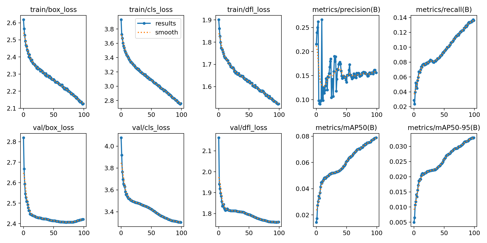
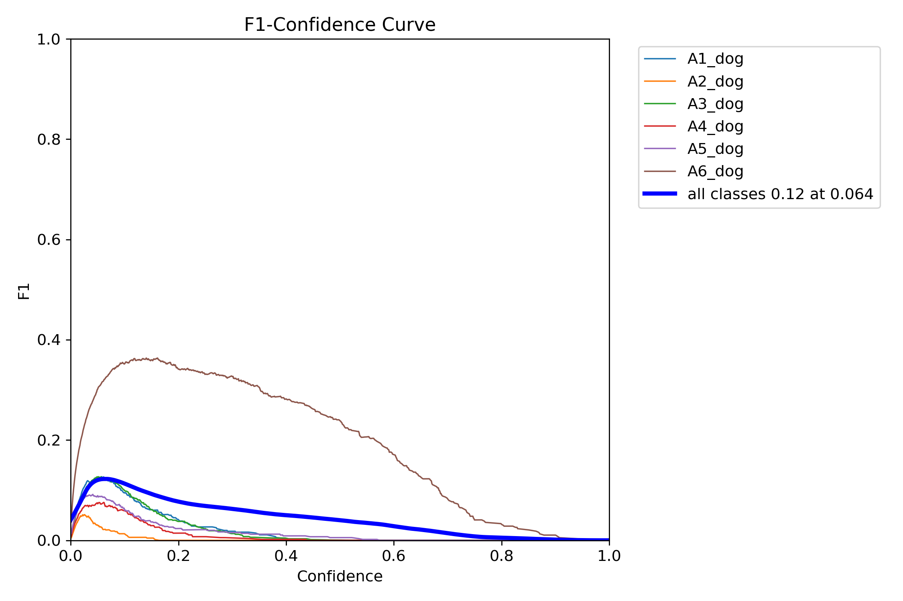
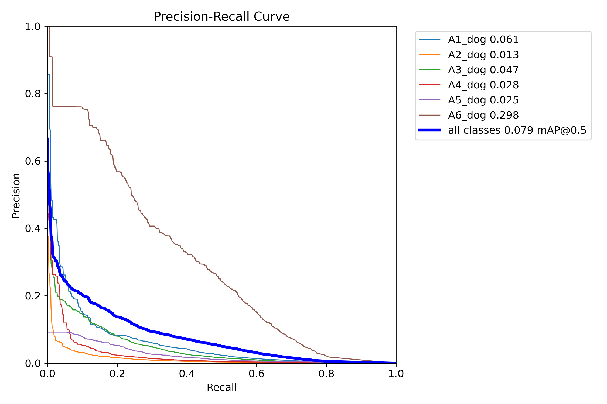
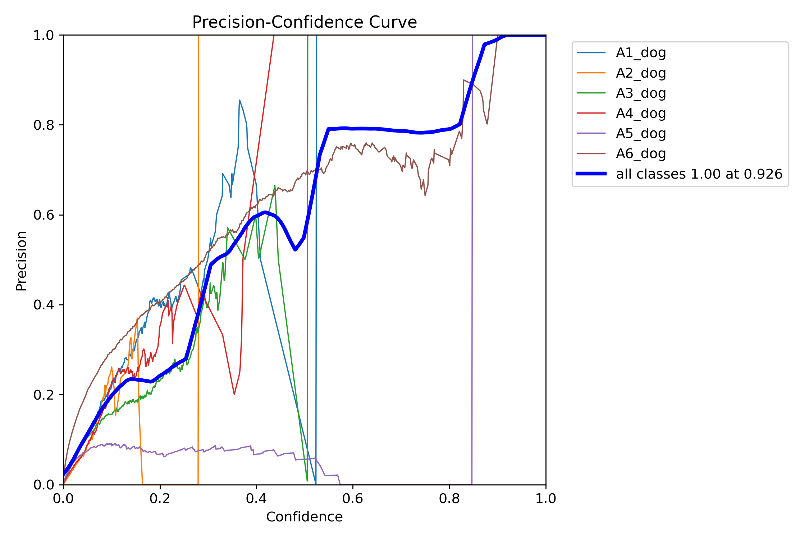
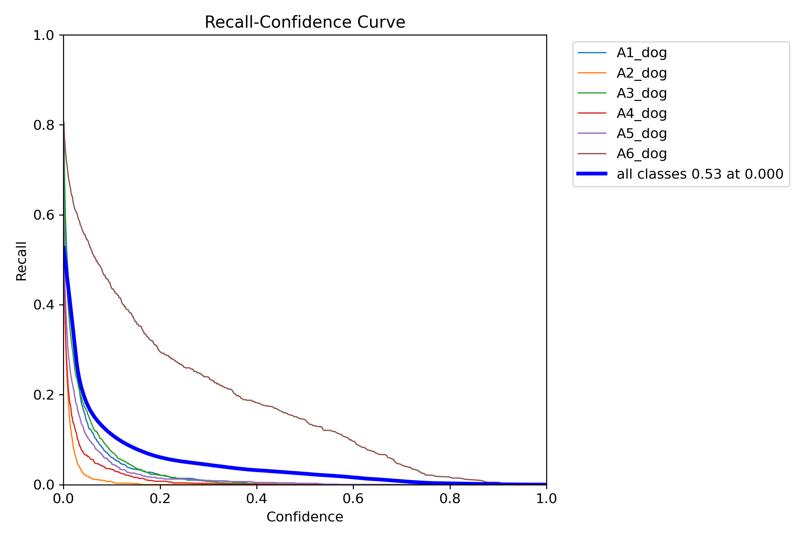

# Yolov8 진행보고 (06/07)

Created: April 15, 2023 7:10 PM
Updated: May 29, 2023 2:29 PM

### Yolov8 POSE 추가학습 사전내용

- Yolo는 Single Stage Method 로서 이미지 내에 존재하는 객체와 위치를 한번만 보고 예측함.

따라서 이전의 모델들에 비해 상대적으로 빠르며 실시간으로 객체를 탐지 할 수 있음.

→ 실시간 객체탐지 모델 중 경량화 장점을 보이는 MobileNet과 비교하기에 적합한 모델이라 판단하여 선정함.

- Ultralytics에서 개발된 모델. 기존 버전과 다르게 이미지 분류 모델을 학습하기 위한 통합 프레임워크로서 출시됨. 이전 버전에 비해서 성능과 속도에서 차이를 보임.
- DarkNet Backbone
- yolov8n Dataset Pretrained Model 을 이용하여 Custom Train 가능.
    - [Train Custom Data 참고](https://docs.ultralytics.com/yolov5/train_custom_data/)

### Dataset

#### AIHUB

- train: 반려견, 반려묘 55,874 (* 반려견 53,170)
- validation: 반려견, 반려묘 6,985
- test: 반려견, 반려묘 랜덤 17,500

#### USE DATA

- train: 반려견 53,170
- validation: 반려견 6,647
- test: 반려견 15,000

### Data Preprocessing
Min Max Scailing

### Training 
- Device GPU
- Image 1920 x 1080 ->  600 X 337.5
- Epochs 100
- learning late 1E-3
- optimizer Adam
- loss VFL Loss, DFL Loss + CIOU Loss 함께 사용

### 학습 결과

### Predict
아래 경로 참고
- /run/yolov8n_custom20/val_batch0_pred.jpg
- /run/yolov8n_custom20/val_batch1_pred.jpg
- /run/yolov8n_custom20/val_batch2_pred.jpg
